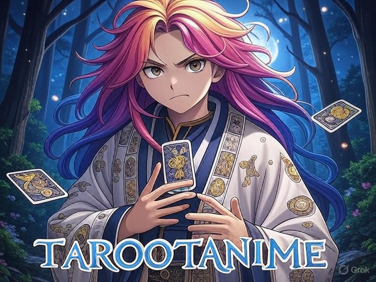

# TarootAnime

  
> # A magia do Tarô com alma de anime

## Índice
1. [Ideia Inicial](#ideia-inicial)
2. [Estruturação do Projeto](#estruturacao-do-projeto)
3. [Design e Protótipo](#design-e-prototipo)
4. [Desenvolvimento do Backend](#desenvolvimento-do-backend)
5. [Preparação para o Deploy e Hospedagem](#preparacao-para-o-deploy-e-hospedagem)
6. [Sobre o Desenvolvedor](#sobre-o-desenvolvedor)

---
**Esta documentação acompanha todo o desenvolvimento do TarootAnime, desde a concepção até a entrega final.  
O projeto está sendo criado completamente do zero, sem seguir roteiros prontos ou cursos passo a passo, garantindo que cada decisão e implementação sejam originais.  
O objetivo é registrar cada etapa de forma organizada, compartilhando decisões, desafios e soluções encontradas ao longo do processo.**
---

## Ideia Inicial
Decidi criar uma aplicação de tarot como uma oportunidade para demonstrar meus conhecimentos em frontend, backend, lógica de programação, integração com APIs e uso de IA (IA para interpretar cartas e responder perguntas de forma personalizada).
Optei por um tema anime para diferenciar o projeto dos aplicativos de tarot tradicionais, além de refletir meu interesse pessoal por esse estilo. A proposta é transmitir aos usuários um pouco da atmosfera única presente nas produções de anime.
O aplicativo será disponibilizado para uso aberto, permitindo que qualquer pessoa possa experimentar a tiragem de cartas e explorar interpretações personalizadas.

## Estruturacao do Projeto
Nesta etapa, defini as principais tecnologias e a organização do código para garantir um desenvolvimento claro, organizado e escalável.  
Utilizei Python com Flask no backend pela sua simplicidade e flexibilidade, e optei por HTML, CSS e JavaScript puro no frontend para facilitar meu aprendizado inicial.  
A estrutura de pastas segue boas práticas, separando código, templates, arquivos estáticos e documentação, criando uma base sólida para o crescimento do projeto.  
[📄Detalhes](docs/02_estruturacao.md)

## Design e Protótipo
Após criar a identidade visual das cartas, iniciei o protótipo da interface com uma abordagem incremental e modular, aliada ao vibe coding assistido por IA (Gemini Pro, Google).  
O foco foi construir e validar cada componente de forma isolada antes da integração, garantindo consistência visual e técnica.  
A escolha por Flask, HTML, CSS e JavaScript puro manteve o projeto leve e didático, enquanto o CSS deu vida ao clima místico inspirado na estética anime.  
[📄Detalhes](docs/03_design_prototipo.md)

## Desenvolvimento do Backend
No backend, construí uma **estrutura modular**, separando responsabilidades entre rotas, serviços e lógica de negócio.  
Os dados das cartas foram organizados em um arquivo JSON externo, e a integração com a **IA (Gemini)** permite gerar respostas personalizadas e místicas para cada tiragem de cartas.  
Durante o processo, consolidei conhecimentos em **organização de código, consumo de APIs, tratamento de erros** e boas práticas do Flask.  
O resultado é um backend funcional, seguro e escalável, pronto para se conectar ao frontend e evoluir conforme novas funcionalidades forem adicionadas.
[📄Detalhes](docs/04_backend_integracoes.md)
conclusão: 19/08/2025

## Preparação para o Deploy e Hospedagem
Com a aplicação totalmente funcional em ambiente local, a etapa final foi publicá-la na internet.  
Para isso, escolhi a plataforma **Render.com**, que oferece integração contínua com o GitHub e um ambiente robusto para aplicações Flask.  
O processo envolveu a preparação do código para produção — adicionando o servidor **Gunicorn** — e a configuração segura das chaves de API como **variáveis de ambiente**.  
Após alguns desafios de configuração, como o ajuste do comando de inicialização e a correção da chave de API, o deploy foi concluído com sucesso, estabelecendo um fluxo de **implantação contínua** (CI/CD) para futuras atualizações.
[📄Detalhes](docs/05_deploy_hospedagem.md)
conclusão: 20/08/2025

## Sobre o Desenvolvedor
Para quem se interessa pelo desenvolvimento do TarootAnime e deseja conhecer melhor quem está por trás do projeto, criei esta seção com informações de contato profissional.

- **Objetivo:** Apresentar minha trajetória de forma transparente, permitindo que recrutadores e interessados vejam minhas competências e outros projetos.
- **Link do LinkedIn:** [Meu Perfil no LinkedIn](https://www.linkedin.com/in/seu-perfil)  
  Aqui, é possível conferir minha experiência, habilidades, recomendações e outros projetos de tecnologia que desenvolvi.
- **GitHub (opcional):** [Meu Perfil no GitHub](www.linkedin.com/in/gustavo-galhaci-436348234)
  Para explorar o código-fonte do TarootAnime e outros repositórios.
